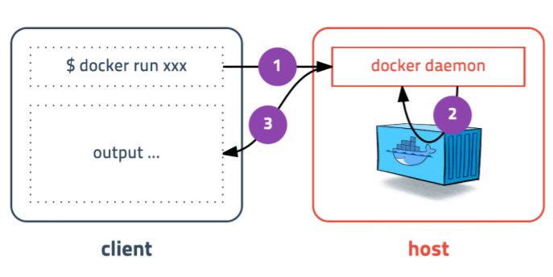

# 도커 컨테이너 만들기

**2020/9/21**

실습 환경이 만들어져 있어서

3.34.94.118:4200 ip로 들어가서

ubuntu / apple-kiwi-apple로 Linux 환경으로 접속

### Agenda

- 컨테이너 실행 `run`

- 컨테이너 목록 확인 `ps` 중지된 컨테이너까지 확인 `ps -a`

- 컨테이너 중지 `stop`

  - `docker stop [OPTIONS] CONTAINER`

- 컨테이너 제거 `rm`

  - `docker rm CONTAINER`

- 컨테이너 로그 `logs` 

  - `docker logs [OPTIONS] CONTAINER_ID`
  - OPTIONS : `-f`, `--tail`

- 도커가 다운로드 한 이미지 목록 확인 `images`

  - `docker images [OPTIONS] [REPOSITORY[:TAG]]`

- 이미지 다운로드 `pull`

- 이미지 삭제 `rmi`

- 네트워크 만들기 `network`

  - `docker network create [OPTIONS] NETWORK`

- 볼륨 마운트 `-v`

  - ```
    $ docker run --name some-mysql -v /my/own/datadir:/var/lib/mysql -e MYSQL_ROOT_PASSWORD=my-secret-pw -d mysql:tag
    ```

    위의 경우 `호스트:컨테이너 내부`

    호스트의 경로에 컨테이너의 것을 복사하는 것.

- Docker Compose


`curl -s https://get.docker.com/ | sudo sh` - 최신버전의 도커를 설치

Docker는 client(command)와 server(daemon)으로 이루어져 있고 서로 버전이 다를 수 있다.




`docker run ubuntu:18.04`

- run 명령어를 사용하면 사용할 이미지가 저장되어 있는지 확인하고 없다면 다운로드(pull)를 한 후 컨테이너를 생성(create)하고 시작(start)합니다.

`docker run --rm -it ubuntu:18.04 /bin/sh`

- 컨테이너 내부에 들어가기 위해 sh를 실행하고 키보드 입력을 위해 -it 옵션을 줍니다.

  추가적으로 프로세스가 종료되면 컨테이너 자동으로 삭제되도록 --rm 옵션 추가

`docker run --rm -it centos:7 /bin/sh`

- 도커는 다양한 리눅스 배포판을 실행할 수 있다. 모두 동일한 **커널**을 사용한다.

`docker run -d -p 4567:4567 subicura/docker-workshop-app:1`

- detached mode(백그라운드 모드)로 실행하기 위해 -d 옵션을 추가하고, -p 옵션을 추가하여 컨테이너의 포트를 호스트의 포트로 연결하였다.
- 브라우저를 열고 localhost:4567에 접속하면 컨테이너 아이디를 확인 할 수 있다.
- `curl localhost:4567` - max & linue
- `docker run --rm byrnedo/alpine-curl docker.for.win.localhost:4567` - window

#### Redis - 메모리기반의 다양한 기능을 가진 스토리지

