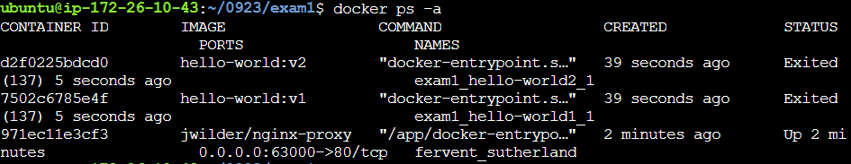

`docker run -d -e VIRTUAL_HOST=echo.3.34.94.118.nip.io ghcr.io/subicura/echo:v2`

http://echo.3.34.94.118.nip.io:60002/


# 배포

도커 컨테이너를 배포합니다.

# 참고

https://nip.io/

# 실습

### Task 1. 컨테이너 업데이트 (docker)

```
이미지 : hello-world:1
Listening Port : 8080
hello-world:1 -> hello-world:2로 업데이트
```

`$ docker run --rm -p 60000:8080 --name=helloworld hello-world:1` 
`$ docker run --rm -p 60000:8080 --name=helloworld hello-world:2`


### Task 2. 컨테이너 업데이트 (docker compose)

```
이미지 : hello-world:1
Listening Port : 8080
hello-world:1 -> hello-world:2로 업데이트
```

**docker-compose.yml**

`version: '3'`
`services: `
  `hello-world: `
    `image: hello-world:$HELLO_WORLD_IMAGE_TAG` 
    `ports: - 60000:8080`

HELLO_WORLD_IMAGE_TAG 환경변수를 이용

`HELLO_WORLD_IMAGE_TAG=v1 docker-compose up`
`HELLO_WORLD_IMAGE_TAG=v1 docker-compose down`
`HELLO_WORLD_IMAGE_TAG=v2 docker-compose up`


### Task 3. nginx-proxy(docker-gen) 사용하기

docker daemon의 event를 이용한 서비스 디스커버리 도구

`$ docker run -d -p 60000:80 \`
 `-v /var/run/docker.sock:/tmp/docker.sock:ro \` 
`jwilder/nginx-proxy`

`$ docker run -d -e VIRTUAL_HOST=echo.{IP}.nip.io hello-world:v1`
`$ docker run -d -e VIRTUAL_HOST=echo.127.0.0.1.nip.io hello-world:v1`
`$ docker run -d -e VIRTUAL_HOST=echo.127.0.0.1.nip.io hello-world:v2`
`$ docker stop xxx`


### Task 4. nginx-proxy 가상 네트워크 사용하기

nginx-proxy는 같은 네트워크에 있는 서비스만 접근이 가능합니다.

docker-compose는 자체적으로 가상네트워크를 자동으로 생성하기 때문에 반드시 별도로 network를 만들고 외부 네트워크로 연결해야 합니다.

`$ docker network create nginx-network`
`$ docker run -d -p 60003:80 \`
  `--network=nginx-network \`
  `-v /var/run/docker.sock:/tmp/docker.sock:ro \`
  `jwilder`/nginx-proxy`


`version: '3'`

`services:`
  `hello:`
    `image: hello-world:v1`
    `environment:`
      `VIRTUAL_HOST: echo.{IP}.nip.io`
`networks:`
  `default:`
    `external:`
      `name: nginx-network`

---

### Exam 1. 앱 버전 업데이트

nodejs를 이용하여 hello world v1, hello world v2 도커 이미지 제작

- node:12 이미지를 기반으로 hello-world:v1, hello-world:v2 두 가지 버전의 이미지를 제작
- 63000 포트로 오픈 / 수동 업데이트

**sample.js**

`var http = require('http');`

`//create a server object:`
`http.createServer(function (req, res) {`
  `res.write('Hello World!');`
  `res.end(); //end the response`
`}).listen(8080);`

**Dockerfile**

`FROM node:12-alpine`

`ADD . /app/`

`WORKDIR /app`
`RUN npm install`

`EXPOSE 8080`

`CMD node sample.js`

**docker-compose.yml**

`version: '3'` 
`services: `
 ` hello-world:` 
  `  image: hello-world:$HELLO_WORLD_IMAGE_TAG `
   ` ports: 
    ` ` \- 63000:8080`

$ docker build -t hello-world:v1 .
$ HELLO_WORLD_IMAGE_TAG=v1 dco up
$ HELLO_WORLD_IMAGE_TAG=v2 dco up

---

### Exam 2. nginx-proxy(docker-gen)을 이용한 업데이트

Exam 1에서 사용한 업데이트 방식을 nginx-proxy로 변경


**docker-compose.yml**

`version: '3'`

`services:`
  `hello-world1:`
    `image: hello-world:v1`
    `environment:`
      `VIRTUAL_HOST: echo.3.34.94.118.nip.io`
  `hello-world2:`
    `image: hello-world:v2`
    `environment:`
      `VIRTUAL_HOST: echo.3.34.94.118.nip.io`
`networks:`
  `default:`
    `external:`
      `name: exam2-network`

`$ docker network create exam2-network`
`$ docker run -d -p 63000:80 \`
  `--network=exam2-network \`
  `-v /var/run/docker.sock:/tmp/docker.sock:ro \`
  `jwilder`/nginx-proxy`

프록시 서버를 두고

dco up을 하면

서비스들의 이미지들인 hello-world:v1 hello-world:v2 동시에 실행


